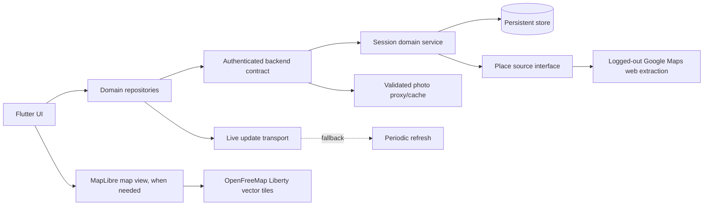

# Hayer: Ground-Up Product and Engineering Specification

> This document is the authoritative reconstruction brief for Hayer. It describes the product to build, not the current repository's backend implementation or migration history. A coding agent should be able to use this file together with `hayer/` as a visual reference and `references/Vela/` as the place-extraction reference.

## 1. Product summary

Hayer is a mobile-first app for deciding where to go. A user chooses what they want, where to search, a radius, and a deck size. Hayer builds a fixed deck of real nearby places, then presents those places as swipeable cards.

- In solo mode, the user swipes alone and receives a ranked list of liked places.
- In multiplayer mode, one person creates a session, shares a six-character code, link, or QR code, and every participant swipes the same ordered deck asynchronously.
- Group results support majority or unanimous matching, followed by one
  editable top-choice ballot per participant.
- Saved places and private notes stay on one device; users can start a room
  from 2–20 saved identities with an optional five-place fresh mix.
- A session may wait until everyone finishes or stop at the first valid match.
- The primary targets are Android, iOS, and web/PWA.

The product promise is:

> Pick what you want, swipe nearby options, and decide—alone or together.

## 2. Authoritative references

Use the following sources in this order:

| Source | Purpose |
| --- | --- |
| `overview.md` | Product behavior, target architecture, logical contracts, and acceptance criteria |
| `hayer/` | Current Flutter UI, theme, routes, assets, and interaction reference |
| `references/Vela/` | Keyless Google Maps web extraction, parsing, calibration, and image handling reference |

Do not reproduce the current backend coupling or incomplete migration code. Rebuild the system around clean domain interfaces and the contracts in this document.

Vela is GPLv3. If source code is copied or adapted directly, comply with its license. Otherwise, use it as a behavioral and protocol reference and implement the required extractor cleanly in the chosen language.

## 3. Non-negotiable product invariants

1. One session owns one immutable, ordered place deck.
2. Every multiplayer participant sees the same places in the same order.
3. A participant may swipe each place at most once.
4. Swipes are private inputs; participant progress, aggregate matches, and
   aggregate destination-choice counts are shared outputs.
5. Sessions expire 24 hours after creation.
6. A six-character uppercase code identifies a session for sharing.
7. The backend is authoritative for identity, membership, place decks, swipes,
   progress, results, and destination choices.
8. Place acquisition uses the Vela-style logged-out Google Maps web extractor as its only POI source.
9. No paid Google developer credential is required or shipped in a client or server.
10. The place deck is fetched once at session creation and persisted; joining, swiping, and viewing results never repeat the place search.
11. The application must remain usable when live updates disconnect by falling back to polling.
12. Provider-specific response shapes must not leak into Flutter UI code.

## 4. Default settings

| Setting | Default | Options |
| --- | --- | --- |
| Mode | Solo | Solo, Multiplayer |
| Radius | 3 km | 500 m, 1 km, 3 km, 5 km, 10 km |
| Deck size | 20 | 10, 20, 30, 40, 50 |
| Price cap | Any | Any, $, $$, $$$, $$$$ |
| Consensus | Majority | Majority, Unanimous |
| Match timing | After everyone finishes | After everyone finishes, Stop on first match |
| Session lifetime | 24 hours | Fixed |

Price is a maximum, not an exact level. A place with unknown price remains eligible when a price cap is selected.

## 5. Target architecture

The implementation must be backend-agnostic. The logical responsibilities matter; the specific server framework, database, authentication product, hosting provider, and realtime technology do not.



### 5.1 Client responsibilities

- Render the setup, join, lobby, swipe, and results flows.
- Establish or restore an anonymous installation identity.
- Send typed commands to the backend.
- Cache the active session code and local swipe queue for recovery.
- Treat server-pushed events as refresh hints, not authoritative state payloads.
- Retry or reconcile failed swipe writes without losing the user's action.
- Submit a destination choice without optimistic vote counts and reconcile a
  lost response from the next authoritative session snapshot.
- Store Want to try/Favorites lists and notes locally, send only ordered place
  IDs for shortlist creation, and fail closed if the server does not preserve
  the selected prefix.
- Never construct extractor requests or parse Google response arrays in UI code.

### 5.2 Backend responsibilities

- Authenticate anonymous installations using an opaque session or token.
- Validate all inputs and derive the user identity from authentication, never request payload fields.
- Create and join sessions transactionally and idempotently.
- Run the place extractor only while creating a new session or resolving a typed location.
- Persist the exact place snapshot and deck order returned to the host.
- Enforce session membership, expiry, one-swipe-per-user-per-place, and consensus rules.
- Authorize one editable destination choice per multiplayer participant after
  matching is ready.
- Expose aggregate results and choice counts without exposing another
  participant's swipe or destination ballot.
- Publish scoped session-change notifications and support polling reads.
- Proxy/cache approved place images when direct loading is unsuitable, especially on web.

### 5.3 Domain seams

Keep infrastructure behind narrow interfaces similar to:

```dart
abstract interface class IdentityRepository {
  Future<AnonymousIdentity> restoreOrCreate();
}

abstract interface class SessionRepository {
  Future<SessionBundle> create(CreateSessionCommand command);
  Future<SessionBundle> join(String code, String displayName);
  Future<SessionBundle> load(String code);
  Future<void> recordSwipe(RecordSwipeCommand command);
  Future<List<SessionResult>> results(String sessionId);
  Future<SessionBundle> chooseDestination(
    String sessionId,
    String placeId,
    int expectedChoiceRevision,
  );
}

abstract interface class PlaceSource {
  Future<List<PlaceCandidate>> search(PlaceSearch request);
  Future<List<LocationPrediction>> suggestLocation(LocationQuery request);
}

abstract interface class SessionEvents {
  Stream<SessionEvent> watch(String sessionId);
}
```

The backend can implement equivalent interfaces in its own language. Wire formats must use provider-neutral names such as `placeId`, not names tied to the extraction source.

### 5.4 One-source policy

Do not assemble Hayer from competing POI databases or provider fallbacks. Follow the two simple responsibilities already proven by Vela:

| Responsibility | Implementation |
| --- | --- |
| Place search, location suggestions, POIs, hours, photos, addresses, coordinates, ratings, review data, and other place details | Vela-style logged-out Google Maps web extraction |
| Basemap rendering, only where Hayer needs an embedded map | MapLibre using Vela's default OpenFreeMap Liberty vector-tile style |

Map tiles provide visual geography only; they are not a second POI source. Do not query Overture, OpenStreetMap POIs, commercial place catalogs, or other fallback indexes. Platform GPS supplies the user's coordinate, and external map applications may handle turn-by-turn navigation after the user chooses a result.

## 6. Place acquisition: the Vela approach

Hayer uses Google Maps' public web responses in the same general way as Vela:

1. Behave like one logged-out browser session.
2. Warm the session against the Maps website and retain ordinary cookies in memory.
3. Send a browser-like user agent, locale, region, and Maps referer.
4. Build the `pb` search parameter from a calibrated template containing the query and viewport.
5. Request the `tbm=map` search response.
6. Strip the XSSI guard and parse the returned positional JSON arrays.
7. Normalize the result into Hayer's provider-neutral `PlaceCandidate` model.
8. Detect parser drift and return a typed `place_source_unavailable` error instead of malformed data.

The main search request is conceptually:

```text
GET https://www.google.com/search
    ?tbm=map
    &authuser=0
    &hl={language}
    &gl={region}
    &q={natural-language query}
    &pb={calibrated viewport request}
```

For the GCC launch audience, derive `gl` from the selected search location or supported country configuration, for example `sa`, `ae`, `kw`, `qa`, `bh`, or `om`. Start with a stable parsing language such as English; add localized response parsing deliberately rather than assuming open/closed text is language-independent.

### 6.1 Extractor modules

Recreate the small, focused structure demonstrated by Vela:

```text
places/
  place_source                  provider-neutral interface
  google_web_place_source       search orchestration
  google_web_session            cookie warming and request headers
  search_pb                     calibrated request construction and pagination
  google_response               XSSI removal and safe positional navigation
  search_parser                 response-to-model normalization
  calibration                   endpoints, templates, paths, and version
  photo_proxy                   validation, resize rules, caching, CORS
```

The extractor must be independently testable with captured response fixtures. UI tests must never depend on live extraction.

### 6.2 Calibration

Google can move fields inside its positional arrays. Store brittle values in a versioned calibration document rather than scattering indices through the parser.

The calibration should contain at least:

- Search endpoint.
- Session warm URL.
- `pb` template.
- Page-size and offset rules.
- Paths for the results list, focused single result, identity, name, coordinates, category, address, rating, review count, price, open status, hours, phone, website, photos, and optional summaries.
- Allowed request and image hosts.
- A calibration version.

Because extraction runs behind the backend, a calibration fix can be deployed without updating the Flutter application. A remote signed configuration channel is optional; a normal backend deployment is sufficient for the first clean implementation.

At the current Vela snapshot, useful paths include:

| Field | Positional path |
| --- | --- |
| Result list | `root[64]` |
| Focused result | `root[0][1][0][14]` |
| Name | `[1][11]` |
| Latitude | `[1][9][2]` |
| Longitude | `[1][9][3]` |
| Address | `[1][39]` |
| Category | `[1][13][0]` |
| Rating | `[1][4][7]` |
| Review count | `[1][4][8]` |
| Price text | `[1][4][2]` |
| Feature ID | `[1][10]` |
| Place ID | `[1][78]` |
| Website | `[1][7][0]` |
| Phone | `[1][178][0][0]` |
| Open/closed text | `[1][203][1][8][0]` |
| Rolling hours | `[1][203][0]` |
| Hero photo block | `[1][72][0]`, URL at each entry's `[6][0]` |
| Featured review | `[1][142][1][0][1][0][0]` |
| Editorial summary | `[1][32][1][1]` |

These paths are documentation, not permanent truth. The checked-in Vela calibration and live fixture tests take precedence.

### 6.3 Search behavior

- Search with natural-language terms such as `restaurants`, `Italian restaurants`, `cafes`, or `tourist attractions`.
- Use the selected anchor as the viewport center.
- Adjust the calibrated viewport span to the requested search radius.
- Treat the remote viewport as a ranking hint, not a hard radius boundary.
- Calculate Haversine distance locally and reject results outside the requested radius.
- Reject entries without a stable ID, name, latitude, or longitude.
- Deduplicate by feature ID, then place ID, then normalized name plus rounded coordinates as a final fallback.
- Apply the maximum price filter after parsing price text; retain unknown prices.
- Rank primarily by review count, then rating, then distance, with a deterministic tie-breaker.
- Persist the resulting order once. Do not reshuffle it independently on clients.

### 6.4 Pagination and deck sizes

The calibrated search request normally returns about 20 results per page. To support larger decks:

- Fetch page one at offset `0`.
- If it is nearly full and more candidates are required, fetch offsets `pageSize` and `pageSize * 2` concurrently.
- Do not paginate focused-name searches that return only a few results.
- Merge, deduplicate, radius-filter, rank, and trim to the requested deck size.
- Store both `deckSizeRequested` and `deckSizeActual`.
- It is valid to return fewer places than requested when the area genuinely lacks enough eligible results.

When several subcategories are selected, run their searches with bounded concurrency, merge them, and favor category diversity so one subcategory does not consume the entire deck.

### 6.5 Place information

The normalized place snapshot may contain:

- Stable place and feature IDs.
- Name.
- Primary category and the selected Hayer subcategory label.
- Latitude and longitude.
- Short/full address.
- Distance from the session anchor.
- Rating and review count.
- Derived price level and original price text.
- Open/closed state, status text, and rolling hours.
- Phone number and website.
- One or more hero photo URLs.
- Featured review and editorial summary when present.
- Source map URL when present.

Missing fields are normal. Cards must degrade cleanly instead of rejecting an otherwise valid place.

### 6.6 Photos

The normal search response supplies enough imagery for Hayer's photo-led cards. Store a validated hero image URL in the place snapshot.

- Accept only HTTPS URLs from an explicit image-host allowlist.
- Normalize the FIFE resize suffix to the requested card width.
- Native clients may load approved URLs directly.
- Web should use a backend media route when required for CORS or cache consistency.
- The media route must only serve URLs already associated with persisted session places; it must never behave as an unrestricted fetch proxy.
- Set bounded cache headers and preserve any attribution returned with the source data.

The complete photo gallery is not required for the first release. Vela uses a browser-engine path for richer galleries because plain HTTP responses can be degraded. Add that only with a dedicated place-details feature.

### 6.7 Reviews and rich details

The first release needs rating, review count, and optional featured review, all available in the search result shape. A full reviews browser is not required by the current Hayer UI.

If a later place-details screen requires full reviews, galleries, or popular times, follow Vela's isolated hidden-WebView pattern on supported native platforms. Keep that optional capability outside the core session/deck contract so web and multiplayer flows do not depend on it.

### 6.8 Location suggestions

Use the same extractor for location search rather than maintaining a separate place provider.

- Ignore input shorter than three trimmed characters.
- Debounce for approximately 350 ms.
- Search near the user's current or last selected location when available.
- Return named places, landmarks, neighborhoods, and addresses from the normalized results.
- Include latitude and longitude directly in each suggestion.
- Selecting a suggestion must not require a second resolve request.

Suggested response shape:

```json
{
  "placeId": "source-place-id",
  "mainText": "Riyadh Park",
  "secondaryText": "Northern Ring Road, Riyadh",
  "fullText": "Riyadh Park, Northern Ring Road, Riyadh",
  "lat": 24.755,
  "lng": 46.630
}
```

GPS remains the fastest and most reliable location path and should stay visually prominent.

### 6.9 Map display

If a Hayer flow needs an embedded map, copy Vela's default basemap approach: render the OpenFreeMap Liberty vector-tile style with MapLibre. Hide the basemap's POI layers and overlay only the already normalized Hayer place snapshots. Do not read POIs from the basemap and do not add a second place source.

An embedded map is optional for the first product flow. The setup, swipe deck, results, sharing, and external-navigation handoff must work without it.

## 7. Hayer taxonomy and search queries

The frontend stores stable Hayer category IDs. It sends only those IDs to the backend. The backend owns the natural-language query mapping so search wording can be tuned without a client release.

Choosing `All` uses the broad query. Selecting subcategories runs one query per selected ID.

### 7.1 Restaurant (`restaurant`, 🍽️)

Broad query: `restaurants`

| UI label | ID | Default search query |
| --- | --- | --- |
| Italian | `italian` | `Italian restaurants` |
| Burgers | `hamburger` | `burger restaurants` |
| Pizza | `pizza` | `pizza restaurants` |
| Sushi | `sushi` | `sushi restaurants` |
| Japanese | `japanese` | `Japanese restaurants` |
| Chinese | `chinese` | `Chinese restaurants` |
| Thai | `thai` | `Thai restaurants` |
| Indian | `indian` | `Indian restaurants` |
| Mexican | `mexican` | `Mexican restaurants` |
| Mediterranean | `mediterranean` | `Mediterranean restaurants` |
| Middle Eastern | `middle_eastern` | `Middle Eastern restaurants` |
| Lebanese | `lebanese` | `Lebanese restaurants` |
| Turkish | `turkish` | `Turkish restaurants` |
| Greek | `greek` | `Greek restaurants` |
| Korean | `korean` | `Korean restaurants` |
| American | `american` | `American restaurants` |
| Steakhouse | `steakhouse` | `steakhouses` |
| Seafood | `seafood` | `seafood restaurants` |
| BBQ | `bbq` | `barbecue restaurants` |
| Vegan | `vegan` | `vegan restaurants` |
| Breakfast | `breakfast` | `breakfast restaurants` |
| Fast Food | `fast_food` | `fast food restaurants` |
| Fine Dining | `fine_dining` | `fine dining restaurants` |
| Ramen | `ramen` | `ramen restaurants` |

### 7.2 Cafe (`cafe`, ☕)

Broad query: `cafes`

| UI label | ID | Default search query |
| --- | --- | --- |
| Coffee Shop | `coffee_shop` | `coffee shops` |
| Espresso Bar | `espresso_bar` | `espresso bars` |
| Tea House | `tea_house` | `tea houses` |
| Bakery | `bakery` | `bakeries` |
| Ice Cream | `ice_cream` | `ice cream shops` |
| Dessert | `dessert` | `dessert shops` |
| Juice Bar | `juice_bar` | `juice bars` |
| Bubble Tea | `bubble_tea` | `bubble tea` |
| Donuts | `donut` | `donut shops` |

### 7.3 Things to Do (`things_to_do`, 🎯)

Broad query: `things to do` or `tourist attractions`

| UI label | ID | Default search query |
| --- | --- | --- |
| Park | `park` | `parks` |
| Museum | `museum` | `museums` |
| Art Gallery | `art_gallery` | `art galleries` |
| Movie Theater | `movie_theater` | `movie theaters` |
| Bowling | `bowling` | `bowling alleys` |
| Amusement Park | `amusement_park` | `amusement parks` |
| Zoo | `zoo` | `zoos` |
| Aquarium | `aquarium` | `aquariums` |
| Spa | `spa` | `spas` |
| Gym | `gym` | `gyms` |
| Bar | `bar` | `bars` |
| Nightclub | `night_club` | `nightclubs` |
| Library | `library` | `libraries` |
| Shopping Mall | `shopping_mall` | `shopping malls` |
| Book Store | `book_store` | `book stores` |
| Beach | `beach` | `beaches` |
| Hiking Trail | `hiking` | `hiking trails` |
| Landmark | `landmark` | `historical landmarks` |

Query wording is configuration, not a public wire contract. It should be possible to tune GCC-specific queries and Arabic search terms without changing Flutter models.

## 8. Navigation and user flows

| Route | Screen | Main exits |
| --- | --- | --- |
| `/` | Home/setup wizard | Solo → swipe; multiplayer → lobby; join; scanner |
| `/scan` | QR scanner | Valid code → join; back → home |
| `/join/:code` | Join form | Success → lobby; close → home |
| `/lobby/:code` | Multiplayer lobby | Swipe; results; home |
| `/swipe/:code` | Swipe deck | Completion → results; close → previous/home |
| `/results/:code` | Results | New search; map/navigation; return to lobby/swipe when relevant |

### 8.1 Startup and identity

1. Initialize Flutter and path-based web URLs.
2. Restore an anonymous installation identity or create one.
3. Restore an active, unexpired session shortcut when available.
4. Launch the home/setup wizard.

Anonymous identity must survive ordinary app restarts. The chosen backend may implement it with anonymous accounts, opaque bearer tokens, signed installation sessions, or an equivalent secure mechanism.

### 8.2 Solo flow

1. Select a broad category and optional subcategories.
2. Select a location using GPS or typed search.
3. Choose radius, price cap, and deck size.
4. Keep Solo selected.
5. Submit setup; show **Finding the best places…**.
6. The backend extracts, filters, ranks, and persists the fixed deck.
7. Open `/swipe/{code}` and resume from the first unswiped place.
8. Swipe through the deck.
9. Open results automatically at completion.
10. Results contain only liked places and can sort by rating, reviews, or distance.

### 8.3 Multiplayer host flow

1. Complete category, location, and option steps.
2. Select Multiplayer.
3. Enter an optional display name; blank becomes `Host`.
4. Choose Majority or Unanimous.
5. Choose after-deck matching or **Stop on first match**.
6. Create the session and open `/lobby/{code}`.
7. Share the join link using QR, copy, or native share.
8. Watch participant progress update.
9. Start swiping immediately or inspect current results.

### 8.4 Multiplayer join flow

Users may enter through:

- A six-character code.
- A scanned QR code.
- A shared `/join/{code}` link.

The joiner enters a display name, joins idempotently, receives the already persisted deck, and opens the lobby. The backend must validate codes and names regardless of client-side validation.

### 8.5 Resume and leave

- Closing the swipe screen asks for confirmation and explains that progress is saved until expiry.
- Re-entering a session resumes at the first place without a durable swipe.
- The client keeps a local pending-swipe queue so a brief connection loss cannot silently discard input.
- If the server already has every swipe, redirect to results.
- Home should expose the most recent active session when possible.

### 8.6 Results before completion

Multiplayer results remain viewable while participants are still swiping. Show only current matches, participant count, completion count, match count, and either **Everyone has finished** or time remaining.

## 9. Screen specification

### 9.1 Home/setup wizard

The home screen is the setup flow, not a marketing landing page.

Chrome:

- Material AppBar with left-aligned **Hayer** title.
- Join-by-code and QR-scan actions.
- An 84 px horizontal timeline with Type, Where, Options, and Mode nodes.
- Completed nodes use check icons and can be tapped to go back.
- Future nodes cannot be tapped.
- Page content is not directly swipeable; sticky bottom buttons control navigation.
- Back is outlined; Continue/final action is filled and takes twice the row width.
- Step content fades and moves slightly upward on entry.

Step 1 — Type:

- Heading: **What are you in the mood for?**
- Three stacked category cards with emoji, name, and type count.
- Selecting a category expands multi-select subcategory chips.
- `All {Category}` means no subcategory IDs are selected.
- Changing broad category clears subcategories.
- Continue is disabled until a category is selected.

Step 2 — Where:

- Heading: **Where to?**
- Pulsing-pin animation until a location is selected.
- Search field plus prominent GPS button.
- Suggestions begin after three characters and a 350 ms debounce.
- Each suggestion shows a primary and optional secondary line.
- Selecting one immediately provides coordinates and full display text.
- GPS uses high accuracy and labels the anchor `Current location`.
- A green confirmation row appears after selection.
- Radius uses a discrete five-stop slider.
- Continue is disabled until coordinates exist.

Step 3 — Options:

- Price chips: Any, $, $$, $$$, $$$$.
- Deck tiles: 10, 20, 30, 40, 50.
- The selected deck tile uses the primary color.

Step 4 — Mode:

- Two cards: 🎯 Solo and 👥 Multiplayer.
- Multiplayer expands display name, consensus chips, and instant-match toggle.
- Final action: **Start Swiping** or **Create Session**.
- Submission uses a dark translucent modal, searching animation, and **Finding the best places…**.

### 9.2 Join dialog and screen

- Code entry is uppercase and capped at six characters.
- Join route shows the code with generous letter spacing.
- Display name is required for joiners.
- Errors are inline and readable.
- Submit button shows a spinner while joining.

### 9.3 QR scanner

- Full-screen camera on black.
- Centered 240 × 240 rounded white scan frame.
- Safe-area back and torch actions.
- Bottom instruction: **Point your camera at a Hayer QR code**.
- Handle only the first valid scan until navigation completes.

### 9.4 Lobby

- AppBar with home action and **Session lobby** title.
- Centered QR in a white rounded container.
- Large code with 8 px letter spacing.
- Copy link and Share actions.
- Information card: radius, actual place count, consensus, timing, expiry.
- Participant rows: tonal avatar, name, optional Host tag, and `current/total` or Done.
- Sticky actions: View results and Start swiping.
- Live changes refresh the session; disconnection activates five-second polling.

### 9.5 Swipe screen

- No standard AppBar; use a custom safe-area header.
- Close action, centered `current / total`, multiplayer share action.
- Six-pixel rounded progress bar.
- Up to three stacked cards with 40 px vertical offsets.
- Horizontal gestures only; no loop.
- Bottom actions: 64 px red dislike and 72 px green like.

Each card contains:

- 24 px radius and cover-fit hero image.
- Loading state and a designed no-photo fallback.
- Transparent-to-black readability gradient.
- Open/Closed and distance badges when known.
- Name, category, rating, compact review count, price, and one-line address.
- A labeled **Details** action that opens the shared place sheet and returns to
  the same card without advancing or recording a swipe.
- Rotated LIKE/NOPE stamp whose opacity tracks drag progress.

Swiping should feel immediate. Persist through a small ordered queue and reconcile failures; never ignore a failed durable write permanently.

### 9.6 Results

- Title: **Your Picks** or **Group Results**.
- Multiplayer stats: code, participants, completed fraction, matches, completion/countdown.
- Sort chips: Rating, Reviews, Distance.
- Solo shows places liked by the current user.
- Multiplayer shows only server-confirmed matches.
- Result card: 84 × 84 image, rank badge, name, rating/reviews, distance, price,
  optional like bar, category, details/map actions, destination-choice count,
  and **My choice**.
- Vote bar: yes percentage and `yes/total`.
- Every multiplayer participant may hold one editable destination ballot. A
  new choice moves that ballot rather than adding another vote.
- The highest choice count is the leader. Once everyone has chosen it is the
  group choice. If leaders are tied, the host's own ballot breaks the tie only
  when it is among those leaders; otherwise the tie remains visible.
- No confirmation dialog, host-only override, runoff, or extra choice screen.
- Choices open after all current participants finish swiping, or when instant
  matching completes the room. A late join pauses new choices without erasing
  saved ballots until the group is ready again.
- The summary names the leader/group choice and offers directions. Sticky
  actions are New search and Share; shared results include the leader and
  aggregate choice counts.

## 10. Visual design system

- Material Design 3.
- Friendly, fresh visual language.
- System light and dark modes.
- Primary seed: teal `#0E9594`.
- Secondary seed: amber `#F5A623`.
- Semantic coral `#EC6A5E`, error red `#E5484D`, success green `#18A058`.
- Nunito typography bundled with the application rather than downloaded at runtime.
- Strong title weights of 700–800 with mildly tight headline tracking.

Shapes and sizing:

- Standard cards: 20 px radius, tonal surface, zero elevation, 1 px outline.
- Selected cards: primary container, 2 px primary outline.
- Inputs: filled tonal surface, 16 px radius, 2 px focus outline.
- Large buttons: minimum 56 px height, 18 px radius, bold 16–17 px labels.
- Chips: stadium shape, bold labels, no checkmark.
- Slider: 8 px track and 12 px thumb radius.
- Floating snackbars: 14 px radius.

Motion:

- Wizard navigation: approximately 350 ms ease-out cubic.
- Step content: 280 ms fade and slight vertical slide.
- Selection containers: 200 ms.
- Timeline active scale: 250 ms ease-out-back.
- Card swipe: approximately 300 ms.
- Respect reduced-motion preferences where available.

Responsive/accessibility requirements:

- Use safe areas and scrolling bodies.
- Add a centered maximum-width shell on tablet and desktop.
- Wrap deck, sort, and action controls on narrow screens or large text.
- Keep web zoom enabled.
- Provide semantics for QR, swipe actions, progress, badges, and images.
- Ensure custom foreground/background pairs meet contrast requirements.
- Prepare strings and directional layout for Arabic/RTL even if localization ships later.

## 11. Domain models

### 11.1 Session

```text
id
code
hostUserId
isSolo
categoryId
subcategoryIds[]
priceLevel?
anchorLat
anchorLng
anchorAddress?
radiusMeters
deckSizeRequested
deckSizeActual
consensusRule       majority | unanimous
matchingTiming      instant | afterDeck
status              active | completed | expired
matchedPlaceId?
createdAt
expiresAt
```

### 11.2 Place snapshot

```text
placeId
featureId?
deckOrder
name
primaryType?
subcategoryLabel?
rating?
reviewCount?
priceLevel?
priceText?
isOpen?
statusText?
hours[]
distanceMeters
latitude
longitude
address?
formattedAddress?
phoneNumber?
websiteUrl?
mapsUrl?
photoUrls[]
featuredReview?
editorialSummary?
attributions[]
```

This is a session-owned snapshot. Source data changing later must not alter an active deck.

### 11.3 Participant

```text
id
sessionId
userId
displayName
isHost
currentIndex
hasCompleted
lastSeenAt
destinationPlaceId
destinationChoiceRevision
```

### 11.4 Swipe

```text
sessionId
userId
placeId
liked
swipeIndex
swipedAt
```

### 11.5 Session result

```text
place
yesVotes
noVotes
totalVoters
yesPercentage
isMatch
```

### 11.6 Destination choice state

```text
eligiblePlaceIds
countsByPlaceId
myPlaceId
myRevision
winnerPlaceId
tiedPlaceIds
chosenCount
participantCount
canChoose
isComplete
hostBrokeTie
```

Only `myPlaceId` identifies a participant's ballot, and it always belongs to
the authenticated caller. Other ballots are represented only by aggregate
counts.

## 12. Logical persistence model

The physical database may be relational, document-oriented, or another transactional store, but it must enforce equivalent constraints.

| Collection/table | Required constraints and indexes |
| --- | --- |
| `sessions` | Unique code; index status + expiry; host index |
| `participants` | Unique session + user; session index; nullable destination place and monotonically increasing choice revision |
| `session_places` | Unique session + deck order; unique session + place ID |
| `swipes` | Unique session + user + place; session/user and session/place indexes |
| `rate_limits` | Unique counter key; expiry index |

Optional operational logs must be bounded, scrubbed of unnecessary precise location/query data, and never become a prerequisite for product behavior.

## 13. Backend contract

The route style below is illustrative. RPC, command functions, GraphQL, or another transport is acceptable if it preserves the same typed behavior.

Every error response carries a stable machine code and a safe user-facing mapping. Core codes include:

```text
bad_request
unauthorized
forbidden
not_found
expired
conflict
no_places
place_source_unavailable
rate_limited
server_error
```

### 13.1 Create session

```http
POST /v1/sessions
```

```json
{
  "isSolo": false,
  "categoryId": "restaurant",
  "subcategoryIds": ["italian", "pizza"],
  "priceLevel": 2,
  "anchor": {
    "lat": 24.7136,
    "lng": 46.6753,
    "address": "Riyadh"
  },
  "radiusMeters": 3000,
  "deckSize": 20,
  "consensusRule": "majority",
  "matchingTiming": "afterDeck",
  "displayName": "Ahmad"
}
```

Required behavior:

1. Validate and clamp supported values.
2. Resolve category IDs to backend-owned search queries.
3. Extract candidate places with bounded concurrency and deadlines.
4. Normalize, radius-filter, price-filter, deduplicate, rank, and trim.
5. Fail with `no_places` if no eligible place remains.
6. Generate a collision-resistant six-character code with bounded retries.
7. Transactionally create session, host participant, and ordered place snapshots.
8. Return `{session, deck, participants}` including the host participant.
9. Make retries safe with an idempotency key.

### 13.2 Join session

```http
POST /v1/sessions/join
```

```json
{"code":"AB7KQ2","displayName":"Sara"}
```

- Normalize and validate the code.
- Reject missing, expired, solo, or otherwise non-joinable sessions.
- Create membership and participant atomically or idempotently return the existing participant.
- Return the persisted ordered deck; never rerun extraction.

### 13.3 Load session

```http
GET /v1/sessions/{code}
```

Return the session, ordered deck, and participants only to a member. Reads must compare the real expiry time even if a cleanup task has not yet changed the stored status.

### 13.4 Record swipe

```http
POST /v1/sessions/{sessionId}/swipes
```

```json
{
  "placeId": "source-place-id",
  "liked": true,
  "swipeIndex": 4
}
```

- Derive user identity from authentication.
- Verify active session, membership, place ownership, and expected progression.
- Enforce one swipe per user/place idempotently.
- Atomically write the swipe and participant progress.
- Mark completion at deck end.
- Evaluate instant matching after a liked swipe.
- Return the durable progress and whether the session just completed or matched.

### 13.5 Results

```http
GET /v1/sessions/{sessionId}/results
```

Return one result per place with its place snapshot and aggregate vote fields. Never return named individual votes to other participants.

### 13.6 Choose destination

```http
POST /v1/sessions/{sessionId}/destination-choice
```

```json
{
  "placeId": "source-place-id",
  "expectedRevision": 1
}
```

- Derive the participant from authentication and require room membership.
- Accept only a current server-confirmed match after choices become available.
- Store exactly one ballot per participant; selecting another place moves it.
- Treat a retry of the already-saved place as a no-op.
- Reject a stale different-place change with `choice_conflict`, then require
  the client to reload before retrying.
- Increment the room revision and emit a results refresh hint.
- Return eligible place IDs, aggregate counts, the caller's ballot/revision,
  and deterministic plurality/tie state. Never return named ballots.

### 13.7 Location suggestions

```http
GET /v1/places/suggest?q=riyadh%20park&lat=...&lng=...
```

Return normalized suggestions including coordinates so selection does not require another lookup.

### 13.8 Photo media

```http
GET /v1/media/place-photo?session={sessionId}&place={placeId}&width=1000
```

Validate membership, place ownership, width bounds, scheme, and host before fetching or serving cached bytes. Return suitable content type, cache, and CORS headers.

## 14. Consensus and lifecycle rules

For each place:

- `yesVotes`: participants who swiped right on that place.
- `noVotes`: participants who swiped left on that place.
- `totalVoters = yesVotes + noVotes` for that place.
- A zero-vote place never matches.
- Majority: `yesVotes > totalVoters / 2`.
- Unanimous: `yesVotes == totalVoters`.

Use the per-place denominator. A participant who has not reached a card is not a no vote.

Instant mode:

- Evaluate only after a liked swipe.
- Require at least two voters in multiplayer before declaring a match.
- On the first strict match, set `matchedPlaceId`, complete the session, and notify clients.

After-deck mode:

- Allow asynchronous progress.
- Make destination choices available when all current participants finish
  without closing the active room to late joiners.
- Keep partial results viewable while waiting.
- If a participant joins later, pause further destination changes until every
  current participant finishes; retain earlier ballots and recalculate
  eligibility from current aggregate swipes.

Default result ordering from the backend:

1. Matches first.
2. Yes percentage descending.
3. Yes votes descending.
4. Review count descending.
5. Rating descending.

The UI may then apply rating, reviews, or distance sorting to its filtered display.

After-deck rooms remain active and joinable until expiry. Instant-match rooms
are completed by the first valid match and are no longer joinable.

Destination election:

- Zero destination ballots produce no leader.
- The highest destination count wins regardless of result-card sort or rating.
- A tied leader is resolved only when the host's ballot belongs to the tie.
- A leader is provisional until every current participant has a valid ballot.
- Likes, completion, navigation taps, and host status never substitute for a
  destination ballot.

## 15. Live updates and consistency

Subscribe only to the current session. A session event may indicate:

```text
participant_joined
participant_progressed
participant_completed
results_changed
session_completed
session_expired
```

Events are refresh hints. On receipt, reload the affected session bundle or results through authenticated reads.

- Do not transmit private swipe or destination choices through broadly visible
  event payloads.
- Coalesce bursts of events.
- Reconnect after lifecycle changes and transient failures.
- Start five-second polling when the live channel is unavailable.
- Stop polling once the live channel recovers.
- Server state always wins over optimistic client state.

## 16. Security and operational requirements

- No secret credential is embedded in Flutter, web assets, native resources, or public configuration.
- Validate every session, participant, place, and swipe relationship server-side.
- Rate-limit session creation, location suggestions, photo access, joins, and public error reporting.
- Bound extractor concurrency, response size, redirects, and deadlines.
- Allowlist every extraction and image hostname; reject arbitrary proxy targets.
- Do not log cookie values, authentication tokens, precise coordinates, or full user queries by default.
- Use transactions or safe compensation for multi-record writes.
- Make create, join, and swipe retries idempotent.
- Expire sessions during reads/writes as well as through periodic cleanup.
- Retain captured extractor fixtures with sensitive fields removed.
- Emit health metrics for extraction success, parser drift, no-place rate, latency, photo failures, and session completion.

Expected extraction failures include network errors, consent redirects, bot-degraded responses, HTTP failures, empty results, and calibration drift. Surface a recoverable message and do not persist a partially parsed deck.

## 17. Flutter project structure

A clean implementation should use feature-first UI with shared domain/data layers:

```text
lib/
  app/
    app.dart
    router.dart
    theme.dart
  core/
    errors/
    formatting/
    networking/
    persistence/
  domain/
    models/
    repositories/
    use_cases/
  data/
    dto/
    repositories/
    local/
    remote/
  features/
    home/
    join/
    lobby/
    swipe/
    results/
```

Guidelines:

- Domain models do not import backend SDK types.
- Remote DTOs are normalized at the data boundary.
- Screens depend on repository/use-case interfaces.
- Keep setup state, active session state, swipe queue, and results state separately testable.
- Persist the anonymous identity token, recent session code, and pending swipe queue securely.
- Use one navigation system with deep-link parsing tested independently.

## 18. Platform requirements

### Web/PWA

- Clean path URLs and SPA fallback for direct links.
- Installable manifest with Hayer name, icons, theme colors, and standalone display.
- Custom loading shell matching the teal/amber theme.
- Service-worker caching must not cache authenticated session responses indiscriminately.
- Keep browser zoom enabled.
- Ensure place images work through the validated media route.

### Android

- Internet, fine/coarse location, and camera permissions.
- Production application ID and release signing.
- HTTPS app-link intent filter for shared join links.
- Use external map/navigation intents for result actions.

### iOS

- Location and camera purpose strings.
- Production bundle ID and release signing.
- Associated domains for universal join links.
- Use the platform map/navigation handoff for result actions.

## 19. Error and empty states

- No places: suggest a larger radius or broader category.
- Location denied: explain that typed location search remains available.
- Suggestion failure: preserve the typed input and show a retryable message.
- Session not found: offer manual re-entry or home.
- Expired session: dedicated expired state with New search.
- Offline during swipe: queue the action and show a subtle pending indicator.
- Photo failure: retain a designed category placeholder.
- Solo with no likes: **No places liked. Start a new search to try again.**
- Multiplayer waiting with no match: explain that results may change as people finish.
- Multiplayer complete with no match: **No places matched the group.**
- Destination choice unavailable: explain that everyone must finish swiping.
- Unresolved destination tie: tell the group that the host must choose one of
  the tied leaders; do not silently use rating, rank, or random order.
- Failed destination change: keep authoritative counts visible and the action
  retryable; a stale revision reloads the caller's latest saved choice.
- Place source unavailable: show a temporary-service message without exposing parser details.

## 20. Testing strategy

### Extractor

- Unit-test `pb` substitutions, span changes, page-size detection, and offsets.
- Parse captured list and focused-result fixtures.
- Test missing/null/moved fields and safe degradation.
- Test XSSI removal and invalid JSON.
- Test deduplication, radius filtering, price derivation, open status, hours, and photo host validation.
- Run a small scheduled live canary against known GCC queries to detect drift without depending on it in normal test runs.

### Domain/backend

- Code generation and collision retry.
- Create/join idempotency.
- Membership and expiry enforcement.
- One swipe per participant/place.
- Sequential progress and resume.
- Majority/unanimous with per-place voters.
- Instant match minimum-voter rule.
- Concurrent final swipes and session completion.
- Result aggregation and ordering.
- Destination choice authorization, editable single-ballot counts, retries,
  stale revisions, plurality, host-ballot ties, expiry, and late joins.
- Photo proxy SSRF protection.

### Flutter

- Setup validation and step navigation.
- Location debounce and selection.
- QR/raw-link code parsing.
- Lobby participant rendering and polling fallback.
- Swipe gestures, buttons, pending queue, retry, and resume.
- Solo/multiplayer result filtering and sorting.
- Choice controls, count refresh, lost-response reconciliation, large text,
  RTL, and no confirmation step.
- Empty/error/expiry/offline states.
- Small phone, large text, tablet, desktop, dark mode, and RTL layout tests.

### End to end

- Solo create → swipe → resume → results.
- Two or more clients create/join the same session and receive identical deck order.
- Majority and unanimous outcomes.
- Simultaneous destination choices, editable ballots, host-ballot ties, and a
  tie where the host has not chosen a leading place.
- Stop on first match.
- Live-update disconnect and polling recovery.
- Deep links and QR flow on web and native.
- Extractor/photo failures do not corrupt a session.

## 21. Recommended ground-up build order

1. Define domain models, repository interfaces, wire contracts, and typed errors.
2. Implement the Vela-style extractor with captured fixtures and calibration.
3. Implement persistence, anonymous identity, create/join/swipe/results, expiry, and rate limits.
4. Add the photo proxy/cache and location suggestions through the same extractor.
5. Rebuild the Flutter theme, router, and four-step setup flow.
6. Add swipe queue/resume and server-authoritative results.
7. Add lobby, QR/link sharing, and scoped live updates with polling fallback.
8. Add responsive/accessibility work and complete platform configuration.
9. Add two-client end-to-end coverage and live extractor canaries.
10. Configure production observability, backups, release signing, and operational runbooks.

## 22. Minimum acceptance checklist

### Solo

- Complete setup with category, optional subcategories, location, radius, price, and deck size.
- Generate a real, fixed, persisted place deck through keyless Google Maps web extraction.
- Support 10–50 requested cards through pagination and multi-query merging.
- Record every swipe idempotently and resume after restart.
- Show only liked places and sort by rating, reviews, and distance.
- Open the selected place in an external map or navigation application.

### Multiplayer

- Create and join through code, QR, and link.
- Isolate sessions by authenticated membership.
- Give every participant the identical ordered deck.
- Show participant progress and survive live-update disconnection.
- Apply majority/unanimous using per-place voters.
- Stop on the first valid instant match when configured.
- Keep partial results viewable while participants are pending.
- Open place details from a swipe card and return without recording a vote.
- Let each participant choose one matched destination, change that choice, see
  aggregate counts, and converge on plurality with the host-ballot tie rule.
- Expire safely after 24 hours.

### Place quality

- GCC-region queries return relevant nearby businesses and attractions.
- Radius filtering is enforced locally after extraction.
- Cards show available photo, hours/open state, address, rating, review count, price, and distance.
- Missing optional fields never crash or discard a valid place.
- Location suggestions include coordinates and need no follow-up resolution request.
- Calibration drift produces a typed recoverable failure.

### Reliability and security

- No paid Google developer credential exists in the project.
- No lost optimistic swipes.
- Duplicate create/join/swipe retries and same-choice retries are safe; stale
  destination changes cannot overwrite a newer ballot.
- Public routes and extraction work are rate-limited.
- No unrestricted image proxy or cross-session data access.
- Missing, expired, empty, denied-permission, photo-failure, and offline states are recoverable.
- Static analysis, unit/widget tests, backend integration tests, and multi-client end-to-end tests pass.

### UI fidelity

- Preserve the teal/amber Material 3 palette, bundled Nunito typography, tonal 20 px cards, 56 px actions, four-step timeline, photo-led swipe cards, lobby QR/code hierarchy, vote bars, safe areas, and short motion timings described above.
- Adapt layouts for small phones, large text, tablets, desktop, and eventual RTL without overflow.

## 23. Explicit non-goals for the first release

- User accounts, profiles, or cross-device history sync.
- User-authored reviews or place edits.
- Full review browsing, full photo galleries, popular-times charts, or Street View inside Hayer.
- Turn-by-turn navigation inside Hayer; external map/navigation handoff is sufficient.
- Offline place extraction.
- Multiple POI providers or automatic fallback to a second place database.
- Re-querying place data for participants after the session deck has been created.

The first release should be excellent at one thing: create a high-quality shared deck of nearby GCC places, make swiping fast and reliable, and produce a trustworthy solo or group decision.
